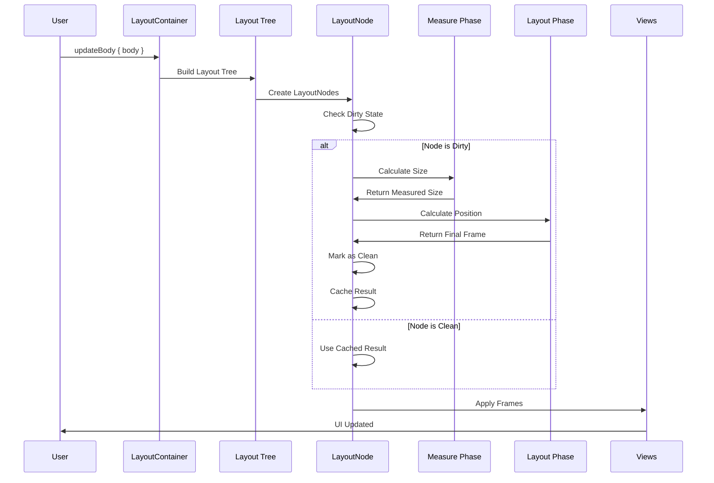
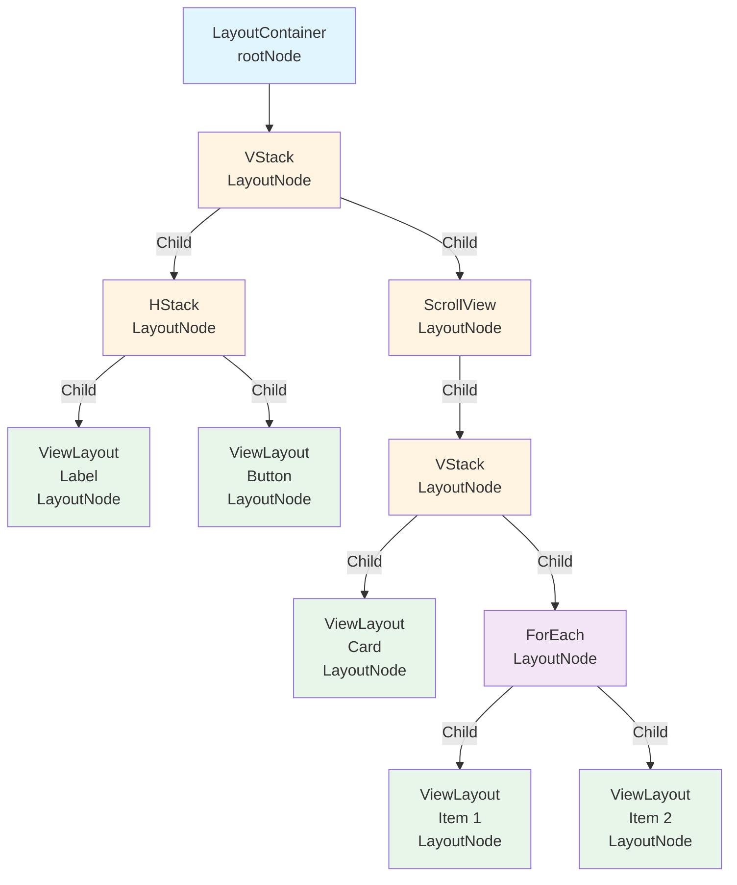

# Layout


[](https://swift.org)
[](https://developer.apple.com/ios/)
[](LICENSE)
[](https://codecov.io/gh/pelagornis/swift-layout)
[](https://swift.org/package-manager)

A high-performance, SwiftUI-style declarative layout system built on **frame-based calculations** — no Auto Layout constraints. Layout combines the readability of SwiftUI with the blazing speed of direct frame manipulation.

## Why Layout?

| Feature            | Auto Layout                  | Layout                    |
| ------------------ | ---------------------------- | ------------------------- |
| **Performance**    | Constraint solving overhead  | Direct frame calculation  |
| **Syntax**         | Imperative constraints       | Declarative SwiftUI-style |
| **Debugging**      | Complex constraint conflicts | Simple frame inspection   |
| **Learning Curve** | Steep                        | Familiar to SwiftUI users |

## ✨ Features

### Core Features

🚀 **High Performance** - Pure frame-based calculations, zero Auto Layout overhead  
📱 **SwiftUI-Style API** - Familiar declarative syntax with `@LayoutBuilder`  
🔄 **Automatic View Management** - Smart view hierarchy handling with automatic add/remove  
🎯 **Zero Dependencies** - Pure UIKit with optional SwiftUI integration  
⚙️ **Two-Phase Layout** - Separate measure and layout phases for optimal performance  
🎯 **Efficient Modifiers** - Modifiers stored as properties, not new nodes

### Layout Components

📦 **VStack** - Vertical stacking with spacing and alignment options  
📦 **HStack** - Horizontal stacking with spacing and alignment options  
📦 **ZStack** - Z-axis stacking with multiple alignment options  
📜 **ScrollView** - Vertical and horizontal scrolling with content offset preservation  
📏 **Spacer** - Flexible space component with minimum length support  
🔄 **ForEach** - Dynamic list generation with identity-based diffing

### Layout Modifiers

📐 **Size** - Fixed or flexible width/height sizing  
📦 **Padding** - Uniform or edge-specific padding  
📍 **Offset** - Position adjustment from calculated layout  
🎨 **Background** - Background color and view support  
🔲 **Corner Radius** - Rounded corner styling  
🆔 **Identity** - View identity for efficient diffing and reuse

### Advanced Features

📐 **GeometryReader** - Access container size and position dynamically  
⚡ **Animation Engine** - Built-in spring and timing animations with `withAnimation`  
🔧 **Environment System** - Color scheme, layout direction, and custom environment values  
🌉 **UIKit ↔ SwiftUI Bridge** - Seamless integration between frameworks  
🎨 **Preferences System** - Pass values up the view hierarchy  
🌳 **Layout Tree & Dirty Propagation** - Incremental layout updates with partial recalculation  
🆔 **Identity & Diff** - Efficient view updates based on identity tracking  
🔄 **Layout Invalidation Rules** - Clear rules for when and how layouts update

### Performance Features

💾 **Layout Caching** - Intelligent caching for repeated layouts  
📊 **Performance Profiler** - Real-time FPS and layout metrics  
📏 **SwiftUI-Style Size Proposals** - Accurate size negotiation with unconstrained dimensions  
⚡ **Incremental Layout** - Only recalculate changed parts of the layout tree

### Developer Tools

🐛 **Debugging Hooks** - Custom hooks for debugging and monitoring  
🔍 **View Hierarchy Analysis** - Detailed layout structure inspection  
📊 **Frame Rate Monitor** - Real-time FPS tracking  
🔗 **UIKit Lifecycle Integration** - Seamless integration with view controller lifecycle

---

## 📦 Installation

### Swift Package Manager

Add the following to your `Package.swift`:

```swift
dependencies: [
    .package(url: "https://github.com/pelagornis/swift-layout.git", from: "vTag")
]
```

Then add `Layout` to your target dependencies:

```swift
.target(
    name: "YourTarget",
    dependencies: ["Layout"]
)
```

### Xcode

1. File → Add Package Dependencies
2. Enter: `https://github.com/pelagornis/swift-layout.git`
3. Select version and add to your project

---

## 🚀 Quick Start

### Basic Setup

```swift
import Layout

class MyViewController: UIViewController, Layout {
    // 1. Create a layout container
    let layoutContainer = LayoutContainer()

    // 2. Create your UI components
    let titleLabel = UILabel()
    let subtitleLabel = UILabel()
    let actionButton = UIButton(type: .system)

    override func viewDidLoad() {
        super.viewDidLoad()

        // 3. Configure views
        titleLabel.text = "Welcome to Layout!"
        titleLabel.font = .systemFont(ofSize: 28, weight: .bold)

        subtitleLabel.text = "High-performance declarative layouts"
        subtitleLabel.font = .systemFont(ofSize: 16)
        subtitleLabel.textColor = .secondaryLabel

        actionButton.setTitle("Get Started", for: .normal)
        actionButton.backgroundColor = .systemBlue
        actionButton.setTitleColor(.white, for: .normal)
        actionButton.layer.cornerRadius = 12

        // 4. Setup container using pure Manual Layout (no Auto Layout)
        setupLayoutContainer(layoutContainer)

        // 5. Set and update the layout body
        layoutContainer.updateBody { self.body }
    }

    override func viewDidLayoutSubviews() {
        super.viewDidLayoutSubviews()
        // Update container frame when bounds change
        updateLayoutContainer(layoutContainer)
    }

    // 6. Define your layout declaratively
    @LayoutBuilder var body: some Layout {
        VStack(alignment: .center, spacing: 16) {
            Spacer(minLength: 100)

            titleLabel.layout()
                .size(width: 300, height: 34)

            subtitleLabel.layout()
                .size(width: 300, height: 20)

            Spacer(minLength: 40)

            actionButton.layout()
                .size(width: 280, height: 50)

            Spacer()
        }
        .padding(20)
    }
}
```

### Using BaseViewController (Recommended)

For the cleanest code, inherit from `BaseViewController`:

```swift
class MyViewController: BaseViewController, Layout {
    let titleLabel = UILabel()
    let actionButton = UIButton()

    override func viewDidLoad() {
        super.viewDidLoad()

        // Setup views
        titleLabel.text = "Welcome"
        actionButton.setTitle("Get Started", for: .normal)

        // Layout container is automatically set up
        // Just override setLayout() to define your layout
    }

    override func setLayout() {
        layoutContainer.updateBody { self.body }
    }

    @LayoutBuilder var body: some Layout {
        VStack(alignment: .center, spacing: 24) {
            titleLabel.layout().size(width: 280, height: 30)
            actionButton.layout().size(width: 240, height: 50)
        }
    }
}
```

### Using UIViewController Extension

For minimal integration without a base class:

```swift
class MyViewController: UIViewController, Layout {
    let layoutContainer = LayoutContainer()
    let titleLabel = UILabel()
    let actionButton = UIButton()

    override func viewDidLoad() {
        super.viewDidLoad()

        // Setup views
        titleLabel.text = "Welcome"
        actionButton.setTitle("Get Started", for: .normal)

        // Setup container (pure Manual Layout, no Auto Layout)
        setupLayoutContainer(layoutContainer)

        // Set and update layout
        layoutContainer.updateBody { self.body }
    }

    override func viewDidLayoutSubviews() {
        super.viewDidLayoutSubviews()
        updateLayoutContainer(layoutContainer)
    }

    @LayoutBuilder var body: some Layout {
        VStack(alignment: .center, spacing: 24) {
            titleLabel.layout().size(width: 280, height: 30)
            actionButton.layout().size(width: 240, height: 50)
        }
    }
}
```

---

## 📦 LayoutContainer

`LayoutContainer` is the main container that manages your layout hierarchy. It provides automatic view management, content centering, and animation protection.

### Key Features

- **Automatic View Management**: Views are automatically added/removed based on layout changes
- **Content Centering**: Content is automatically centered like SwiftUI
- **Animation Protection**: Prevents layout system from overriding animated views
- **Layout Updates**: Smart layout invalidation with clear rules
- **Two-Phase Layout**: Separate measure and layout phases for optimal performance
- **Pure Manual Layout**: Zero Auto Layout constraints, only frame-based calculations

### Animation Protection

When animating views directly, use `startAnimating` and `stopAnimating` to prevent the layout system from overriding your animations:

```swift
// Mark view as animating
layoutContainer.startAnimating(myView)

// Animate the view
withAnimation(.easeInOut(duration: 0.3)) {
    myView.frame.size = CGSize(width: 300, height: 200)
}

// Stop animating after completion
withAnimation(.easeInOut(duration: 0.3), {
    myView.frame.size = CGSize(width: 300, height: 200)
}, completion: { _ in
    layoutContainer.stopAnimating(myView)
})

// Check if any views are animating
if layoutContainer.isAnimating {
    // Layout updates are automatically paused
}
```

### Layout Updates

```swift
// Set body and update immediately (recommended)
layoutContainer.updateBody { self.body }

// Or set body first, then update separately
layoutContainer.setBody { self.body }
layoutContainer.updateBody()

// Update existing body without changing it
layoutContainer.updateBody()

// Force layout update
layoutContainer.setNeedsLayout()
layoutContainer.layoutIfNeeded()

// Update layout for orientation changes
layoutContainer.updateLayoutForOrientationChange()
```

### Layout Invalidation Rules

Layout uses clear invalidation rules to determine when layouts need to be recalculated:

```swift
// Invalidation rules are automatically applied
let rules = LayoutInvalidationRules.default

// Check if a reason should trigger invalidation
if rules.shouldInvalidate(for: .hierarchyChanged) {
    // Layout will be invalidated
}

// Check invalidation priority
let priority = rules.priority(for: .sizeChanged) // Returns 3
```

---

## 🎨 Layout Components

### VStack (Vertical Stack)

Arranges children vertically from top to bottom.

```swift
VStack(alignment: .center, spacing: 16) {
    headerView.layout()
        .size(width: 300, height: 60)

    contentView.layout()
        .size(width: 300, height: 200)

    footerView.layout()
        .size(width: 300, height: 40)
}
```

**Parameters:**

- `alignment`: `.leading`, `.center`, `.trailing` (default: `.center`)
- `spacing`: Space between children (default: `0`)

### HStack (Horizontal Stack)

Arranges children horizontally from leading to trailing.

```swift
HStack(alignment: .center, spacing: 12) {
    iconView.layout()
        .size(width: 44, height: 44)

    VStack(alignment: .leading, spacing: 4) {
        titleLabel.layout().size(width: 200, height: 20)
        subtitleLabel.layout().size(width: 200, height: 16)
    }

    Spacer()

    chevronIcon.layout()
        .size(width: 24, height: 24)
}
.padding(16)
```

**Parameters:**

- `alignment`: `.top`, `.center`, `.bottom` (default: `.center`)
- `spacing`: Space between children (default: `0`)

### ZStack (Overlay Stack)

Overlays children on top of each other.

```swift
ZStack(alignment: .topTrailing) {
    // Background (bottom layer)
    backgroundImage.layout()
        .size(width: 300, height: 200)

    // Content (middle layer)
    contentView.layout()
        .size(width: 280, height: 180)

    // Badge (top layer, positioned at top-trailing)
    badgeView.layout()
        .size(width: 30, height: 30)
        .offset(x: -10, y: 10)
}
```

**Parameters:**

- `alignment`: Any combination of vertical (`.top`, `.center`, `.bottom`) and horizontal (`.leading`, `.center`, `.trailing`)

### ScrollView

Adds scrolling capability to content with automatic content offset preservation.

```swift
// Vertical scrolling (default)
ScrollView {
    VStack(alignment: .center, spacing: 20) {
        // Header
        headerView.layout()
            .size(width: 350, height: 200)

        // Multiple content sections
        ForEach(sections) { section in
            sectionView.layout()
                .size(width: 350, height: 150)
        }

        // Bottom spacing
        Spacer(minLength: 100)
    }
}

// Horizontal scrolling
ScrollView(.horizontal) {
    HStack(spacing: 16) {
        ForEach(items) { item in
            itemView.layout()
                .size(width: 200, height: 150)
        }
    }
}

// With safe area offset adjustment
let scrollView = ScrollView {
    contentView.layout()
}
scrollView.adjustsContentOffsetForSafeArea = true
```

### Spacer

Flexible space that expands to fill available room.

```swift
VStack(alignment: .center, spacing: 0) {
    Spacer(minLength: 20)  // At least 20pt, can grow

    titleLabel.layout()

    Spacer()  // Flexible space, takes remaining room

    buttonView.layout()

    Spacer(minLength: 40)  // Safe area padding
}
```

---

## 🎛️ Layout Modifiers

### Size

```swift
// Fixed size
myView.layout()
    .size(width: 200, height: 100)

// Width only (height flexible)
myView.layout()
    .size(width: 200)

// Height only (width flexible)
myView.layout()
    .size(height: 50)

// Percentage-based size
myView.layout()
    .size(width: 90%, height: 100)

// Mixed fixed and percentage
myView.layout()
    .size(width: 80%, height: 50)

// Percentage syntax with postfix operator
let width: Percent = 80%  // Using postfix % operator
myView.layout()
    .size(width: width, height: 100)
```

**Percentage-based Sizing:**

Layout supports percentage-based sizing using the `%` postfix operator:

```swift
// Direct percentage syntax
myView.layout()
    .size(width: 90%, height: 100)

// Percentage is calculated relative to parent container's size
VStack(alignment: .center, spacing: 16) {
    headerView.layout()
        .size(width: 90%, height: 60)  // 90% of VStack's width

    contentView.layout()
        .size(width: 80%, height: 200)  // 80% of VStack's width
}

// Mix percentage and fixed sizes
cardView.layout()
    .size(width: 50%, height: 140)  // 50% width, fixed 140pt height
```

**Edge Positioning with Percentages:**

```swift
// Position views using percentage offsets
myView.layout()
    .size(width: 100, height: 100)
    .top(10%)      // 10% from top
    .leading(20%)  // 20% from leading edge
    .centerX()     // Center horizontally
```

### Padding

```swift
// Uniform padding
VStack { ... }
    .padding(20)

// Edge-specific padding
VStack { ... }
    .padding(UIEdgeInsets(top: 20, left: 16, bottom: 40, right: 16))
```

### Offset

```swift
// Move view from its calculated position
myView.layout()
    .size(width: 100, height: 100)
    .offset(x: 10, y: -5)
```

### Background & Corner Radius

```swift
VStack { ... }
    .layout()
    .size(width: 300, height: 200)
    .background(.systemBlue)
    .cornerRadius(16)
```

### Chaining Modifiers

```swift
cardView.layout()
    .size(width: 320, height: 180)
    .padding(16)
    .background(.tertiarySystemBackground)
    .cornerRadius(20)
    .offset(y: 10)
```

**Performance Note**: Modifiers are stored as properties on the view itself (using Associated Objects), not as new nodes. This means modifier chains don't create new `ViewLayout` instances, providing optimal performance.

---

## 📐 GeometryReader

`GeometryReader` provides access to its container's size and position, enabling dynamic layouts.

### Declarative Style (with @LayoutBuilder)

```swift
GeometryReader { proxy in
    // Use proxy.size for dynamic sizing
    VStack(alignment: .center, spacing: 8) {
        topBox.layout()
            .size(width: proxy.size.width * 0.8, height: 60)

        bottomBox.layout()
            .size(width: proxy.size.width * 0.6, height: 40)
    }
}
.layout()
.size(width: 360, height: 140)
```

### Imperative Style (for Complex Layouts)

When you need direct control over view placement:

```swift
GeometryReader { proxy, container in
    // Calculate dimensions based on container size
    let availableWidth = proxy.size.width - 32
    let columnWidth = (availableWidth - 16) / 2

    // Create and position views manually
    let leftColumn = createColumn()
    leftColumn.frame = CGRect(x: 16, y: 16, width: columnWidth, height: 100)
    container.addSubview(leftColumn)

    let rightColumn = createColumn()
    rightColumn.frame = CGRect(x: 16 + columnWidth + 16, y: 16, width: columnWidth, height: 100)
    container.addSubview(rightColumn)
}
```

### GeometryProxy Properties

```swift
GeometryReader { proxy, container in
    // Container dimensions
    let width = proxy.size.width      // CGFloat
    let height = proxy.size.height    // CGFloat

    // Safe area information
    let topInset = proxy.safeAreaInsets.top
    let bottomInset = proxy.safeAreaInsets.bottom

    // Position in global coordinate space
    let globalX = proxy.globalFrame.minX
    let globalY = proxy.globalFrame.minY

    // Local bounds (origin is always 0,0)
    let bounds = proxy.bounds  // CGRect
}
```

### Geometry Change Callback

React to size changes:

```swift
let geometryReader = GeometryReader { proxy in
    contentView.layout()
        .size(width: proxy.size.width, height: proxy.size.height)
}
.onGeometryChange { proxy in
    print("Size changed: \(proxy.size)")
    print("Global position: \(proxy.globalFrame.origin)")
}

// Use in layout
geometryReader.layout()
    .size(width: 300, height: 200)
```

---

## ⚡ Animation Engine

Layout provides SwiftUI-style animation support with `withAnimation` and animation modifiers.

### withAnimation Function

The `withAnimation` function provides SwiftUI-like animation blocks:

```swift
// Basic animation
withAnimation {
    self.view.alpha = 1.0
    self.view.frame.size = CGSize(width: 200, height: 200)
}

// Custom animation
withAnimation(.spring(damping: 0.7, velocity: 0.5)) {
    self.cardView.transform = CGAffineTransform(scaleX: 1.2, y: 1.2)
}

// With completion handler
withAnimation(.easeInOut(duration: 0.3), {
    self.view.frame.origin = CGPoint(x: 100, y: 100)
}, completion: { finished in
    print("Animation completed: \(finished)")
})
```

### Animation Presets

```swift
// Predefined animations
withAnimation(.default)      // 0.3s easeInOut
withAnimation(.spring)        // Spring animation with damping 0.7
withAnimation(.quick)         // 0.15s easeOut

// Custom timing functions
withAnimation(.easeIn(duration: 0.4))
withAnimation(.easeOut(duration: 0.3))
withAnimation(.easeInOut(duration: 0.5))
withAnimation(.linear(duration: 0.3))

// Custom spring
withAnimation(.spring(damping: 0.6, velocity: 0.8))
```

### Protecting Animations from Layout System

When animating views directly, protect them from layout system interference:

```swift
// Mark view as animating
layoutContainer.startAnimating(myView)

// Animate the view
withAnimation(.easeInOut(duration: 0.3)) {
    myView.frame.size = CGSize(width: 300, height: 200)
}

// Stop animating after completion
withAnimation(.easeInOut(duration: 0.3), {
    myView.frame.size = CGSize(width: 300, height: 200)
}, completion: { _ in
    layoutContainer.stopAnimating(myView)
})

// Check if any views are animating
if layoutContainer.isAnimating {
    // Layout updates are paused
}
```

### LayoutAnimation Structure

```swift
// Create custom animation
let customAnimation = LayoutAnimation(
    duration: 0.5,
    delay: 0.1,
    timingFunction: .easeInOut,
    repeatCount: 1,
    autoreverses: false
)

// Use with withAnimation
withAnimation(customAnimation) {
    // Your animations
}
```

---

## 🔧 Environment System

### Color Scheme Detection

```swift
// Get current color scheme
let colorScheme = ColorScheme.current

switch colorScheme {
case .light:
    view.backgroundColor = .white
case .dark:
    view.backgroundColor = .black
}

// React to changes
override func traitCollectionDidChange(_ previous: UITraitCollection?) {
    super.traitCollectionDidChange(previous)
    EnvironmentProvider.shared.updateSystemEnvironment()

    // Update your UI based on new color scheme
    updateColorsForCurrentScheme()
}
```

### Layout Direction

```swift
// Check for RTL languages
let direction = LayoutDirection.current

if direction == .rightToLeft {
    // Adjust layout for RTL
    stackView.semanticContentAttribute = .forceRightToLeft
}
```

### Environment Values

```swift
// Access shared environment
let env = EnvironmentValues.shared

// Custom environment keys
extension EnvironmentValues {
    var customSpacing: CGFloat {
        get { self[CustomSpacingKey.self] }
        set { self[CustomSpacingKey.self] = newValue }
    }
}

struct CustomSpacingKey: EnvironmentKey {
    static let defaultValue: CGFloat = 16
}
```

---

## 📊 Performance Monitoring

### Frame Rate Monitor

```swift
// Start monitoring
FrameRateMonitor.shared.start()

// Check current FPS (updated in real-time)
let currentFPS = FrameRateMonitor.shared.currentFPS
let averageFPS = FrameRateMonitor.shared.averageFPS

// Display in UI
Timer.scheduledTimer(withTimeInterval: 1.0, repeats: true) { _ in
    let fps = FrameRateMonitor.shared.averageFPS
    self.fpsLabel.text = String(format: "%.0f FPS", fps)
    self.fpsLabel.textColor = fps >= 55 ? .systemGreen : .systemRed
}

// Stop when done
FrameRateMonitor.shared.stop()
```

### Layout Cache

```swift
// Check cache performance
let hitRate = LayoutCache.shared.hitRate  // 0.0 - 1.0
print("Cache hit rate: \(Int(hitRate * 100))%")

// Clear cache if needed
LayoutCache.shared.clearCache()

// Get cache statistics
let stats = LayoutCache.shared.statistics
print("Hits: \(stats.hits), Misses: \(stats.misses)")
```

### Performance Profiler

```swift
// Profile a layout operation
let profiler = PerformanceProfiler.shared

profiler.startProfiling(name: "ComplexLayout")

// ... perform layout operations ...

profiler.endProfiling(name: "ComplexLayout")

// Get all profiles
let profiles = profiler.allProfiles
for profile in profiles {
    print("\(profile.name): \(profile.duration)ms")
}

// Check for warnings
let warnings = profiler.allWarnings
for warning in warnings {
    print("⚠️ \(warning.message)")
}
```

---

## 🌉 UIKit ↔ SwiftUI Bridge

### UIKit View in SwiftUI

```swift
import SwiftUI
import Layout

struct MySwiftUIView: View {
    var body: some View {
        VStack {
            Text("SwiftUI Header")
                .font(.title)

            // Use any UIKit view in SwiftUI
            createCustomChart()
                .swiftui  // ← Converts to SwiftUI View
                .frame(height: 200)

            // UIKit labels, buttons, etc.
            UILabel().configure {
                $0.text = "UIKit Label"
                $0.textAlignment = .center
            }
            .swiftui
            .frame(height: 44)
        }
    }

    func createCustomChart() -> UIView {
        let chart = CustomChartView()
        chart.data = [10, 20, 30, 40, 50]
        return chart
    }
}
```

### SwiftUI View in UIKit

```swift
class MyViewController: UIViewController {
    override func viewDidLoad() {
        super.viewDidLoad()

        // Create SwiftUI view
        let swiftUIContent = MySwiftUIView()

        // Convert to UIKit hosting controller
        let hostingController = swiftUIContent.uikit

        // Add as child view controller
        addChild(hostingController)
        view.addSubview(hostingController.view)
        hostingController.view.frame = view.bounds
        hostingController.view.autoresizingMask = [.flexibleWidth, .flexibleHeight]
        hostingController.didMove(toParent: self)
    }
}
```

---

## 🌳 Layout Tree & Dirty Propagation

Layout provides an incremental layout system that only recalculates parts of the layout that have changed, significantly improving performance for complex UIs.

### Key Concepts

- **Layout Tree**: A hierarchical representation of layout components, allowing efficient traversal and targeted updates
- **Dirty Propagation**: When a child layout changes, it marks its parent and ancestors as "dirty," indicating they need recalculation
- **Incremental Layout**: Only dirty nodes are recalculated, avoiding full layout passes

### Enabling Incremental Layout

By default, incremental layout is enabled. You can toggle it:

```swift
// Enable incremental layout (default)
layoutContainer.useIncrementalLayout = true

// Disable for full recalculation every time
layoutContainer.useIncrementalLayout = false
```

### Marking Views as Dirty

When a view's content changes, mark it as dirty to trigger incremental recalculation:

```swift
// Mark a specific view as dirty
layoutContainer.markViewDirty(myLabel)

// The layout system will:
// 1. Find the LayoutNode containing this view
// 2. Mark that node and its ancestors as dirty
// 3. Recalculate only the dirty parts in the next layout pass
```

### Example: Dynamic Content Updates

```swift
class MyViewController: BaseViewController, Layout {
    let layoutContainer = LayoutContainer()
    let cardLabels: [UILabel] = (0..<6).map { _ in UILabel() }
    var cardCounts = Array(repeating: 0, count: 6)

    override func viewDidLoad() {
        super.viewDidLoad()
        layoutContainer.useIncrementalLayout = true
        setupLayoutContainer(layoutContainer)
        layoutContainer.updateBody { self.body }
    }

    @LayoutBuilder var body: some Layout {
        VStack(alignment: .center, spacing: 16) {
            // Multiple cards in a grid
            VStack(alignment: .center, spacing: 12) {
                HStack(alignment: .center, spacing: 12) {
                    createCard(index: 0).layout()
                    createCard(index: 1).layout()
                }
                HStack(alignment: .center, spacing: 12) {
                    createCard(index: 2).layout()
                    createCard(index: 3).layout()
                }
            }

            // Update buttons
            createUpdateButton(title: "Update Card 1") {
                self.updateCard(at: 0)
            }
        }
    }

    private func updateCard(at index: Int) {
        // Update the card's content
        cardCounts[index] += 1
        cardLabels[index].text = "Count: \(cardCounts[index])"

        // Mark only this view as dirty - only this card will be recalculated!
        layoutContainer.markViewDirty(cardLabels[index])
    }
}
```

### Invalidating the Entire Tree

For major changes, invalidate the entire layout tree:

```swift
// Invalidate entire tree (forces full recalculation)
layoutContainer.invalidateLayoutTree()

// Rebuild the layout tree (useful when toggling incremental layout)
layoutContainer.rebuildLayoutTree()
```

### Performance Benefits

With incremental layout enabled:

- **Partial Recalculation**: Only changed nodes are recalculated
- **Cached Results**: Clean nodes use cached layout results
- **Dirty Propagation**: Changes automatically propagate up the tree
- **View Preservation**: Views remain in the hierarchy during updates

### When to Use

✅ **Use incremental layout when:**

- You have complex layouts with many views
- Only small parts of the UI change frequently
- You want optimal performance for dynamic content

❌ **Disable incremental layout when:**

- Layout structure changes frequently
- You need full recalculation for debugging
- Performance is not a concern

### Layout Tree Structure

The layout tree mirrors your layout hierarchy:

```
LayoutContainer (rootNode)
└── VStack (LayoutNode)
    ├── HStack (LayoutNode)
    │   ├── Card 1 (LayoutNode)
    │   └── Card 2 (LayoutNode)
    └── HStack (LayoutNode)
        ├── Card 3 (LayoutNode)
        └── Card 4 (LayoutNode)
```

Each `LayoutNode` tracks:

- **Dirty State**: Whether the node needs recalculation (new nodes start dirty)
- **Cached Result**: Layout result when node is clean
- **Parent-Child Relationships**: Tree structure for efficient traversal
- **Child Nodes**: Automatically built from layout hierarchy (VStack, HStack, etc.)

### Dirty Propagation

When a child node is marked dirty, it automatically propagates to its parent:

```swift
// Child node becomes dirty
childNode.markDirty()

// Parent is automatically marked dirty due to propagation
// This ensures parent layout is recalculated when child changes
```

### Layout Calculation Flow

1. **Initial State**: New `LayoutNode` instances start with `isDirty = true`
2. **Calculation**: `calculateLayout()` is called, node is marked clean
3. **Children Cleanup**: After parent calculation, dirty children are marked clean
4. **Incremental Updates**: Only dirty nodes are recalculated in subsequent passes

---

## 🆔 Identity & Diff

Layout provides identity-based diffing to efficiently update views when layout changes. By assigning identities to views, the system can track and reuse views across updates, minimizing unnecessary view creation and removal.

### Setting View Identity

Use the `.id()` modifier to assign an identity to a view:

```swift
@LayoutBuilder var body: some Layout {
    VStack(spacing: 10) {
        // Use item ID as identity
        ForEach(items) { item in
            ItemView(item: item)
                .layout()
                .id(item.id)  // Identity based on item ID
        }

        // Use string identity
        headerView.layout()
            .id("header")

        // Use any Hashable type
        footerView.layout()
            .id(123)  // Integer identity
    }
}
```

### How Identity Diffing Works

1. **View Tracking**: Views with identities are tracked in a map
2. **Diff Calculation**: When layout updates, the system compares old and new identity maps
3. **Efficient Updates**:
   - **Same Identity**: Reuses existing view instance (no removal/addition)
   - **New Identity**: Adds new view
   - **Removed Identity**: Removes view that no longer exists
   - **Changed Identity**: Replaces view when identity changes

### Benefits

✅ **View Reuse**: Views with matching identities are reused, preserving state  
✅ **Efficient Updates**: Only changed views are added/removed  
✅ **State Preservation**: View state (scroll position, selection, etc.) is maintained  
✅ **Performance**: Reduces view creation/destruction overhead

### Example: Dynamic List

```swift
class ItemListViewController: BaseViewController, Layout {
    var items: [Item] = []

    @LayoutBuilder var body: some Layout {
        ScrollView {
            VStack(spacing: 12) {
                ForEach(items) { item in
                    ItemCard(item: item)
                        .layout()
                        .id(item.id)  // Identity ensures efficient updates
                        .size(width: 350, height: 80)
                }
            }
        }
    }

    func updateItems(_ newItems: [Item]) {
        items = newItems
        layoutContainer.updateBody { self.body }
        // Only changed items are updated, others are reused!
    }
}
```

### Identity Best Practices

- **Use Stable Identifiers**: Use IDs that don't change for the same logical view
- **Unique Identities**: Each view should have a unique identity within its parent
- **Optional Identity**: Views without identity still work, but won't benefit from diffing
- **Hashable Types**: Any `Hashable` type can be used as identity (String, Int, UUID, etc.)

### Integration with Layout Tree

Identity diffing works seamlessly with the Layout Tree system:

- Identity-based updates trigger dirty propagation
- Only views with changed identities cause recalculation
- Clean views with matching identities use cached results

---

## 🔍 Debugging

### Enable Debugging

```swift
// Enable all debugging
LayoutDebugger.shared.enableAll()

// Enable specific features
LayoutDebugger.shared.isEnabled = true
LayoutDebugger.shared.enableViewHierarchy = true
LayoutDebugger.shared.enableSpacerCalculation = true
LayoutDebugger.shared.enableFrameSettings = true

// Disable all
LayoutDebugger.shared.disableAll()
```

### Custom Debugging Hooks

Set custom hooks to intercept and customize debug output:

```swift
// Set a custom hook for layout calculations
LayoutDebugger.shared.setDebuggingHook({ message, component in
    // Custom logging logic
    MyCustomLogger.log("\(component): \(message)")
}, for: .layout)

// Set a hook for view hierarchy
LayoutDebugger.shared.setDebuggingHook({ message, component in
    // Send to analytics
    Analytics.track("LayoutHierarchy", parameters: ["message": message])
}, for: .hierarchy)
```

### View Hierarchy Analysis

```swift
LayoutDebugger.shared.analyzeViewHierarchy(
    layoutContainer,
    title: "MY LAYOUT"
)
```

**Output:**

```
🔍 ===== MY LAYOUT =====
🔍 LayoutContainer
├─ Frame: (20.0, 100.0, 350.0, 600.0)
├─ Background: systemBackground
├─ Hidden: false
└─ Alpha: 1.0
  └─ VStack
    ├─ Frame: (0.0, 20.0, 350.0, 560.0)
    ├─ Spacing: 16.0
    └─ Alignment: center
      ├─ UILabel "Welcome"
      │   ├─ Frame: (25.0, 0.0, 300.0, 34.0)
      │   └─ Font: .boldSystemFont(28)
      ├─ Spacer
      │   └─ Frame: (0.0, 50.0, 350.0, 400.0)
      └─ UIButton "Get Started"
          ├─ Frame: (35.0, 466.0, 280.0, 50.0)
          └─ Background: systemBlue
```

### Debug Categories

| Category       | Description                |
| -------------- | -------------------------- |
| 🔧 Layout      | Layout calculation process |
| 🏗️ Hierarchy   | View hierarchy structure   |
| 📐 Frame       | Frame setting and changes  |
| 🔲 Spacer      | Spacer calculation details |
| ⚡ Performance | Performance metrics        |

---

## 🏗️ Architecture

### Overview

Layout is built on a **frame-based calculation system** that separates measurement from placement, enabling high-performance declarative layouts without Auto Layout constraints. The architecture is designed to be modular, extensible, and performant.

### Architecture Diagram

```
┌─────────────────────────────────────────────────────────────────┐
│                        User Code Layer                          │
├─────────────────────────────────────────────────────────────────┤
│                                                                 │
│  ┌────────────────┐       ┌──────────────┐                      │
│  │UIViewController│──────►│@LayoutBuilder│                      │
│  │                │       │    body      │                      │
│  └────────────────┘       └──────────────┘                      │
│         │                        │                              │
│         └────────────┬───────────┘                              │
│                      ▼                                          │
└─────────────────────────────────────────────────────────────────┘
                      │
                      ▼
┌─────────────────────────────────────────────────────────────────┐
│                      LayoutContainer                            │
├─────────────────────────────────────────────────────────────────┤
│                                                                 │
│  ┌──────────────────────────────────────────────────────────┐   │
│  │  ┌──────────────┐  ┌──────────────┐  ┌──────────────┐    │   │
│  │  │View Hierarchy│  │Layout Calc   │  │Identity Map  │    │   │
│  │  │  Management  │  │Orchestration │  │   Tracking   │    │   │
│  │  └──────────────┘  └──────────────┘  └──────────────┘    │   │
│  │                                                          │   │
│  │  ┌──────────────┐  ┌──────────────┐                      │   │
│  │  │Animation     │  │Incremental   │                      │   │
│  │  │Protection    │  │Layout Updates│                      │   │
│  │  └──────────────┘  └──────────────┘                      │   │
│  └──────────────────────────────────────────────────────────┘   │
│                                                                 │
└─────────────────────────────────────────────────────────────────┘
                      │
                      ▼
┌─────────────────────────────────────────────────────────────────┐
│                      Layout System                              │
├─────────────────────────────────────────────────────────────────┤
│                                                                 │
│  ┌──────────────┐         ┌──────────────┐                      │
│  │ Layout Tree  │────────►│ LayoutNodes  │                      │
│  │              │         │              │                      │
│  └──────────────┘         └──────────────┘                      │
│         │                        │                              │
│         │                        ▼                              │
│         │              ┌──────────────────┐                     │
│         │              │ Dirty State      │                     │
│         │              │ Cache Management │                     │
│         │              └──────────────────┘                     │
│         │                                                       │
└─────────┼───────────────────────────────────────────────────────┘
          │
          ▼
┌─────────────────────────────────────────────────────────────────┐
│                    Layout Components                            │
├─────────────────────────────────────────────────────────────────┤
│                                                                 │
│  ┌────────┐  ┌────────┐  ┌────────┐  ┌──────────┐  ┌───────────┐│
│  │ VStack │  │ HStack │  │ ZStack │  │ScrollView│  │ViewLayout ││
│  └────────┘  └────────┘  └────────┘  └──────────┘  └───────────┘│
│                                                                 │
│  ┌────────┐  ┌────────┐                                         │
│  │ Spacer │  │ForEach │                                         │
│  └────────┘  └────────┘                                         │
│                                                                 │
└─────────────────────────────────────────────────────────────────┘
                      │
                      ▼
┌─────────────────────────────────────────────────────────────────┐
│                  Two-Phase Layout System                        │
├─────────────────────────────────────────────────────────────────┤
│                                                                 │
│  ┌──────────────────────┐         ┌──────────────────────┐      │
│  │  Measure Phase       │────────►│  Layout Phase        │      │
│  │  Calculate Size      │         │  Calculate Position  │      │
│  │                      │         │                      │      │
│  │  • Intrinsic Size    │         │  • Alignment         │      │
│  │  • Size Modifiers    │         │  • Position Mods     │      │
│  │  • Percentage Calc   │         │  • Final Frame       │      │
│  └──────────────────────┘         └──────────────────────┘      │
│                                                                 │
└─────────────────────────────────────────────────────────────────┘
                      │
                      ▼
┌─────────────────────────────────────────────────────────────────┐
│                    Modifier System                              │
├─────────────────────────────────────────────────────────────────┤
│                                                                 │
│  UIView ──(Associated Object)──► layoutModifiers[]              │
│                                    │                            │
│                                    ├─► SizeModifier             │
│                                    ├─► OffsetModifier           │
│                                    ├─► BackgroundModifier       │
│                                    └─► PaddingModifier          │
│                                                                 │
└─────────────────────────────────────────────────────────────────┘
```

### Layout Calculation Flow



### Layout Tree Structure



### Two-Phase Layout System

```
┌─────────────────────────────────────────────────────────────┐
│                    Phase 1: Measure                         │
├─────────────────────────────────────────────────────────────┤
│                                                             │
│  Proposed Bounds                                            │
│       │                                                     │
│       ▼                                                     │
│  Intrinsic Size                                             │
│       │                                                     │
│       ▼                                                     │
│  Size Modifiers                                             │
│  (Fixed, Percentage, Flexible)                              │
│       │                                                     │
│       ▼                                                     │
│  Measured Size ───────────────────┐                         │
│                                   │                         │
└───────────────────────────────────┼─────────────────────────┘
                                    │
                                    ▼
┌─────────────────────────────────────────────────────────────┐
│                    Phase 2: Layout                          │
├─────────────────────────────────────────────────────────────┤
│                                                             │
│  Measured Size                                              │
│       │                                                     │
│       ▼                                                     │
│  Position Modifiers                                         │
│  (Offset, Center, Alignment)                                │
│       │                                                     │
│       ▼                                                     │
│  Alignment Rules                                            │
│       │                                                     │
│       ▼                                                     │
│  Final Frame                                                │
│                                                             │
└─────────────────────────────────────────────────────────────┘
```

### Incremental Layout System

```
┌─────────────────────────────────────────────────────────────┐
│                    Initial State                            │
├─────────────────────────────────────────────────────────────┤
│                                                             │
│  All Nodes Clean ✓                                          │
│       │                                                     │
│       ▼                                                     │
│  Layout Calculated                                          │
│       │                                                     │
│       ▼                                                     │
│  Results Cached                                             │
│                                                             │
└─────────────────────────────────────────────────────────────┘
                    │
                    │ Change Detected
                    ▼
┌─────────────────────────────────────────────────────────────┐
│                  Change Detected                            │
├─────────────────────────────────────────────────────────────┤
│                                                             │
│  View Content Changes                                       │
│       │                                                     │
│       ▼                                                     │
│  Mark View as Dirty                                         │
│       │                                                     │
│       ▼                                                     │
│  Propagate to Parent                                        │
│  (Dirty State Propagation)                                  │
│                                                             │
└─────────────────────────────────────────────────────────────┘
                    │
                    ▼
┌─────────────────────────────────────────────────────────────┐
│                Incremental Update                           │
├─────────────────────────────────────────────────────────────┤
│                                                             │
│  Find Dirty Nodes                                           │
│       │                                                     │
│       ├──────────────────┬──────────────────┐               │
│       │                  │                  │               │
│       ▼                  ▼                  ▼               │
│  Recalculate        Use Cache          Skip Clean           │
│  Only Dirty         for Clean          Nodes                │
│       │                  │                  │               │
│       └──────────────────┴──────────────────┘               │
│                       │                                     │
│                       ▼                                     │
│              Update Frames                                  │
│                       │                                     │
│                       ▼                                     │
│              Mark as Clean ✓                                │
│                                                             │
└─────────────────────────────────────────────────────────────┘
                    │
                    │ (Loop back)
                    ▼
            Return to Initial State
```

### Identity-Based Diffing

```
┌──────────────┐         ┌──────────────┐         ┌──────────────┐
│ Old Layout   │         │ Diff Engine  │         │ New Layout   │
│              │         │              │         │              │
│ View A (id:  │────────►│ Extract      │◄────────│ View A (id:  │
│  'header')   │         │ Identities   │         │  'header')   │
│              │         │              │         │              │
│ View B (id:  │────────►│              │◄────────│ View D (id:  │
│  'content')  │         │ Compare      │         │  'content')  │
│              │         │ Maps         │         │              │
│ View C (id:  │────────►│              │◄────────│ View E (id:  │
│  'footer')   │         │              │         │  'sidebar')  │
└──────────────┘         └──────────────┘         └──────────────┘
                                │
                                │ Calculate Diff
                                ▼
                    ┌───────────────────────┐
                    │   Diff Results        │
                    ├───────────────────────┤
                    │                       │
                    │ Match: View A ────────┼──► Reuse (State Preserved)
                    │                       │
                    │ Changed: B → D ───────┼──► Replace
                    │                       │
                    │ New: View E ──────────┼──► Create
                    │                       │
                    │ Removed: View C ──────┼──► Remove
                    │                       │
                    └───────────────────────┘
                                │
                                ▼
                    ┌───────────────────────┐
                    │ Updated View          │
                    │ Hierarchy             │
                    └───────────────────────┘
```

### Core Architecture Principles

1. **Two-Phase Layout System**: Separates measurement (size calculation) from placement (position calculation)
2. **Incremental Updates**: Only recalculates parts of the layout that have changed
3. **Identity-Based Diffing**: Efficiently updates views by tracking identities
4. **Modifier Storage**: Modifiers stored as properties, not as new layout nodes
5. **Platform Abstraction**: Supports both UIKit and AppKit through conditional compilation

### Core Components

#### 1. Layout Protocol

The `Layout` protocol is the foundation of the entire system. All layout components conform to this protocol:

```swift
@MainActor
public protocol Layout {
    func calculateLayout(in bounds: CGRect) -> LayoutResult
    func extractViews() -> [UIView]
    var intrinsicContentSize: CGSize { get }
}
```

**Key Responsibilities:**

- **`calculateLayout(in:)`**: Calculates frame positions for all managed views
- **`extractViews()`**: Returns the views managed by this layout
- **`intrinsicContentSize`**: Provides natural size for the layout

#### 2. LayoutContainer

`LayoutContainer` is the main orchestrator that manages the entire layout hierarchy:

**Responsibilities:**

- View hierarchy management (automatic add/remove)
- Layout calculation orchestration
- Identity-based view diffing
- Animation protection
- Incremental layout updates
- Content centering

**Key Properties:**

- `body`: The root layout definition
- `useIncrementalLayout`: Enables incremental updates
- `rootNode`: Root of the layout tree for incremental updates

#### 3. ViewLayout

`ViewLayout` wraps individual `UIView` instances and provides modifier support:

**Two-Phase Layout:**

1. **Measure Phase**: Calculates the size the view wants based on modifiers
2. **Layout Phase**: Calculates the final position based on size and alignment

**Modifier Storage:**

- Modifiers stored as associated objects on the view itself
- No new `ViewLayout` instances created for modifier chains
- Efficient property-based storage

#### 4. Layout Components

**Stack Components:**

- `VStack`: Vertical stacking with spacing and alignment
- `HStack`: Horizontal stacking with spacing and alignment
- `ZStack`: Z-axis stacking with multiple alignment options

**Container Components:**

- `ScrollView`: Scrollable container with content offset preservation
- `Spacer`: Flexible space component

**Dynamic Components:**

- `ForEach`: Dynamic list generation with identity-based diffing

### Layout Calculation Flow

The following diagram shows the complete flow from user code to rendered UI:

```
User Code
    │
    │ @LayoutBuilder body
    ▼
┌─────────────────────┐
│ LayoutContainer     │
│   updateBody()      │
└─────────────────────┘
    │
    │ Build Layout Tree
    ▼
┌─────────────────────┐
│ Layout Tree         │
│ (LayoutNode         │
│  hierarchy)         │
└─────────────────────┘
    │
    │ View Hierarchy Diffing
    ▼
┌─────────────────────┐
│ Identity-based      │
│ Diffing             │
└─────────────────────┘
    │
    │ Incremental Layout?
    ├─────────┬─────────┐
    │ Yes     │ No      │
    ▼         ▼         ▼
┌─────────┐ ┌─────────────────┐
│ Check   │ │ Full            │
│ Dirty   │ │ Calculation     │
│ State   │ └─────────────────┘
└─────────┘
    │
    ├─────────┬─────────┐
    │ Dirty   │ Clean   │
    ▼         ▼         │
┌─────────┐ ┌─────────┐ │
│ Measure │ │ Use     │ │
│ Phase   │ │ Cached  │ │
└─────────┘ └─────────┘ │
    │         │         │
    └─────────┴─────────┘
              │
              ▼
    ┌─────────────────┐
    │ Layout Phase    │
    │ (Calculate      │
    │  Positions)     │
    └─────────────────┘
              │
              ▼
    ┌─────────────────┐
    │ Apply Frames    │
    │ to Views        │
    └─────────────────┘
              │
              ▼
    ┌─────────────────┐
    │ Update View     │
    │ Hierarchy       │
    └─────────────────┘
              │
              ▼
         UI Rendered
```

### Two-Phase Layout System

The layout system separates measurement from placement:

**Phase 1: Measure**

- Calculate desired size for each view
- Respects size modifiers (fixed, percentage, flexible)
- Uses intrinsic content size as base
- Results cached for reuse

**Phase 2: Layout**

- Calculate final position based on measured size
- Applies alignment and positioning modifiers
- Respects parent container constraints
- Sets final frame on views

**Benefits:**

- Measurement can be cached independently
- Placement can be recalculated without remeasuring
- Supports responsive layouts with percentage-based sizing
- Enables efficient incremental updates

### Incremental Layout System

The incremental layout system only recalculates parts of the layout that have changed:

**Layout Tree Structure:**

The layout tree mirrors your view hierarchy, with each component represented as a `LayoutNode`:

```
┌─────────────────────────────────────────────────────────────────┐
│                    LayoutContainer                              │
│                    (rootNode)                                   │
│                    isDirty: false ✓                             │
└────────────────────────────┬────────────────────────────────────┘
                             │
                             ▼
              ┌───────────────────────────────┐
              │      VStack (LayoutNode)      │
              │      isDirty: false ✓         │
              └───────────────┬───────────────┘
                              │
                ┌─────────────┴─────────────┐
                │                           │
                ▼                           ▼
┌───────────────────────────┐  ┌───────────────────────────┐
│  HStack (LayoutNode)      │  │  ScrollView (LayoutNode)  │
│  isDirty: true            │  │  isDirty: false ✓         │
└───────────┬───────────────┘  └─────────────┬─────────────┘
            │                                │
    ┌───────┴───────┐                        │
    │               │                        │
    ▼               ▼                        ▼
┌──────────┐  ┌──────────┐          ┌────────────────────┐
│ViewLayout│  │ViewLayout│          │ VStack (LayoutNode)│
│  Label   │  │  Button  │          │ isDirty: false ✓   │
│          │  │          │          └──────────┬─────────┘
│isDirty:  │  │isDirty:  │                     │
│true      │  │false ✓   │                     ▼
└──────────┘  └──────────┘          ┌──────────────────┐
                                    │ ViewLayout Card  │
                                    │                  │
                                    │ isDirty: false ✓ │
                                    └──────────────────┘

┌─────────────────────────────────────────────────────────────────┐
│                            Legend                               │
├─────────────────────────────────────────────────────────────────┤
│                                                                 │
│  Dirty (will be recalculated in next layout pass)               │
│  Clean (uses cached result, skipped in calculation)             │
│                                                                 │
│  When a node is dirty:                                          │
│    • It and all its children are recalculated                   │
│    • Results are cached after calculation                       │
│    • Parent nodes are marked dirty (propagation)                │
│                                                                 │
│  When a node is clean:                                          │
│    • Uses cached layout result                                  │
│    • Skips calculation entirely                                 │
│    • Improves performance significantly                         │
│                                                                 │
└─────────────────────────────────────────────────────────────────┘
```

**Dirty Propagation:**

- When a child node changes, it marks itself as dirty
- Dirty state propagates up to parent nodes
- Only dirty nodes are recalculated
- Clean nodes use cached results

**Key Components:**

- `LayoutNode`: Represents a node in the layout tree
- `IncrementalLayoutCache`: Caches layout results
- `DirtyRegionTracker`: Tracks which regions need recalculation

### Identity-Based Diffing

Views are tracked by identity for efficient updates:

**Identity System:**

- Views can have explicit identity via `.id()` modifier
- Identity used for view reuse across layout updates
- Views with matching identities are reused (not recreated)
- Enables state preservation (scroll position, selection, etc.)

**Diffing Process:**

The identity-based diffing process efficiently updates views:

```mermaid
flowchart LR
    subgraph "Old Layout"
        O1[View A<br/>id: 'header']
        O2[View B<br/>id: 'content']
        O3[View C<br/>id: 'footer']
    end

    subgraph "Diff Engine"
        D1[Extract Identities]
        D2[Compare Maps]
        D3[Calculate Diff]
    end

    subgraph "New Layout"
        N1[View A<br/>id: 'header']
        N2[View D<br/>id: 'content']
        N3[View E<br/>id: 'sidebar']
    end

    subgraph "Actions"
        A1[Reuse: View A]
        A2[Replace: B → D]
        A3[Add: View E]
        A4[Remove: View C]
    end

    O1 --> D1
    O2 --> D1
    O3 --> D1
    N1 --> D1
    N2 --> D1
    N3 --> D1

    D1 --> D2
    D2 --> D3

    D3 -->|Match| A1
    D3 -->|Changed| A2
    D3 -->|New| A3
    D3 -->|Removed| A4

    style A1 fill:#e8f5e9
    style A2 fill:#fff4e1
    style A3 fill:#e1f5ff
    style A4 fill:#ffebee
```



### Modifier System

Modifiers are stored as properties on views, not as new layout nodes:

**Storage Mechanism:**

```
┌─────────────────────────────────────────────────────────────┐
│                    View Instance                             │
├─────────────────────────────────────────────────────────────┤
│                                                               │
│  UIView                                                       │
│    │                                                          │
│    │ (Associated Object)                                      │
│    ▼                                                          │
│  ┌──────────────────────┐                                    │
│  │ layoutModifiers[]    │                                    │
│  ├──────────────────────┤                                    │
│  │ • SizeModifier       │                                    │
│  │ • OffsetModifier     │                                    │
│  │ • BackgroundModifier │                                    │
│  │ • PaddingModifier    │                                    │
│  └──────────────────────┘                                    │
│                                                               │
└─────────────────────────────────────────────────────────────┘
                    ▲
                    │
┌───────────────────┴───────────────────────────────────────────┐
│              Modifier Chain (User Code)                      │
├───────────────────────────────────────────────────────────────┤
│                                                               │
│  view.ui()                                                    │
│    .size(width: 200, height: 100)  ────┐                     │
│    .offset(x: 10, y: 20)            ────┤                     │
│    .background(.systemBlue)         ────┼──► Stores in        │
│    .padding(16)                      ────┤   layoutModifiers[]│
│                                         │                     │
└─────────────────────────────────────────┼─────────────────────┘
                                          │
                                          ▼
┌─────────────────────────────────────────────────────────────┐
│            Layout Calculation                               │
├─────────────────────────────────────────────────────────────┤
│                                                               │
│  calculateLayout(in:)                                        │
│    │                                                          │
│    │ Reads layoutModifiers[]                                 │
│    ▼                                                          │
│  Applies modifiers in order:                                  │
│    1. Size modifiers (Measure Phase)                          │
│    2. Position modifiers (Layout Phase)                      │
│    3. Style modifiers                                        │
│    │                                                          │
│    ▼                                                          │
│  Final Frame                                                  │
│                                                               │
└─────────────────────────────────────────────────────────────┘
```

**Key Benefits:**

- Uses Associated Objects to store modifiers
- Modifiers stored in `view.layoutModifiers` array
- No new `ViewLayout` instances for modifier chains
- Efficient property-based access
- Modifiers persist across layout updates

**Modifier Types:**

```
                    Modifiers
                         │
        ┌────────────────┼────────────────┐
        │                │                │
        ▼                ▼                ▼
┌──────────────┐ ┌──────────────┐ ┌──────────────┐
│ Size         │ │ Position     │ │ Style        │
│ Modifiers    │ │ Modifiers    │ │ Modifiers    │
├──────────────┤ ├──────────────┤ ├──────────────┤
│              │ │              │ │              │
│ • Fixed      │ │ • Offset     │ │ • Background │
│   width: 200 │ │   x: 10      │ │   .systemBlue│
│              │ │   y: 20      │ │              │
│ • Percentage │ │              │ │ • Corner     │
│   width: 80% │ │ • Center     │ │   Radius: 12│
│              │ │   centerX    │ │              │
│ • Flexible   │ │   centerY    │ │ • Padding    │
│   height: nil│ │              │ │   insets: 16 │
│              │ │ • Alignment  │ │              │
│              │ │   leading    │ │              │
│              │ │   trailing    │ │              │
└──────────────┘ └──────────────┘ └──────────────┘
        │                │                │
        └────────────────┼────────────────┘
                         │
                         ▼
              ┌──────────────────┐
              │ Identity         │
              │ Modifiers        │
              ├──────────────────┤
              │ • .id('unique')  │
              └──────────────────┘
```

### Animation System

The animation system protects animated views from layout interference:

**Animation Protection Flow:**

```
User Code
    │
    │ startAnimating(view)
    ▼
┌─────────────────────┐
│ LayoutContainer     │
│                     │
│ Add to              │
│ animatingViews set  │
└─────────────────────┘
    │
    │ withAnimation { ... }
    ▼
┌─────────────────────┐
│ Animation Engine    │
│                     │
│ Apply animation     │
│ to view             │
└─────────────────────┘
    │
    │ Animate frame/transform
    ▼
┌─────────────────────┐
│ Animated View       │
│ (frame changing)    │
└─────────────────────┘
    ▲
    │
    │ Layout System attempts
    │ frame update
    │
┌─────────────────────┐
│ LayoutContainer     │
│                     │
│ Check isAnimating   │
│                     │
│ Skip frame update   │
│ (view is animating) │
└─────────────────────┘
    │
    │ Animation completes
    │ stopAnimating(view)
    ▼
┌─────────────────────┐
│ LayoutContainer     │
│                     │
│ Remove from         │
│ animatingViews      │
│                     │
│ Resume frame        │
│ updates             │
└─────────────────────┘
```

**Animation Architecture:**

```
┌─────────────────────────────────────────────────────────────┐
│                    User API                                 │
├─────────────────────────────────────────────────────────────┤
│                                                               │
│  ┌──────────────┐  ┌──────────────┐  ┌──────────────┐      │
│  │withAnimation │  │startAnimating│  │stopAnimating │      │
│  └──────────────┘  └──────────────┘  └──────────────┘      │
│         │                │                │                │
│         └────────────────┼────────────────┘                │
│                         │                                   │
└─────────────────────────┼───────────────────────────────────┘
                          │
                          ▼
┌─────────────────────────────────────────────────────────────┐
│                LayoutContainer                               │
├─────────────────────────────────────────────────────────────┤
│                                                               │
│  ┌──────────────────────┐  ┌──────────────────────┐        │
│  │ animatingViews Set   │  │animatingViewIdentifiers│       │
│  │                      │  │                      │        │
│  │ • Tracks animating   │  │ • ObjectIdentifier   │        │
│  │   views              │  │   tracking          │        │
│  └──────────────────────┘  └──────────────────────┘        │
│         │                                                    │
│         │ Protects from layout updates                       │
│         ▼                                                    │
└─────────────────────────────────────────────────────────────┘
                          │
                          ▼
┌─────────────────────────────────────────────────────────────┐
│              Animation Engine                                │
├─────────────────────────────────────────────────────────────┤
│                                                               │
│  ┌──────────────────────┐                                    │
│  │LayoutAnimationEngine │                                    │
│  │                      │                                    │
│  │ • Manages animation  │                                    │
│  │   state              │                                    │
│  │ • Coordinates timing │                                    │
│  └──────────────────────┘                                    │
│         │                                                    │
│         ├──────────────┬──────────────┐                     │
│         ▼              ▼              ▼                     │
│  ┌──────────┐  ┌──────────┐  ┌──────────┐                  │
│  │Layout    │  │Timing    │  │Platform  │                  │
│  │Animation │  │Function  │  │APIs      │                  │
│  └──────────┘  └──────────┘  └──────────┘                  │
│                                                               │
│         │              │              │                     │
│         └──────────────┴──────────────┘                     │
│                          │                                   │
│                          ▼                                   │
│              ┌──────────────────────┐                        │
│              │ UIView.animate      │                        │
│              │ NSAnimationContext │                        │
│              └──────────────────────┘                        │
│                                                               │
└─────────────────────────────────────────────────────────────┘
```

**Key Features:**

- `startAnimating(_:)`: Marks view as animating
- `stopAnimating(_:)`: Removes animation protection
- Layout system skips frame updates for animating views
- `withAnimation` provides SwiftUI-style animation blocks
- `LayoutAnimationEngine`: Manages animation state
- `LayoutAnimation`: Defines animation parameters
- `AnimationTimingFunction`: Timing functions (ease, spring, etc.)
- Platform-specific animation APIs (UIView.animate / NSAnimationContext)

### Environment System

The environment system provides context values throughout the layout hierarchy:

**Environment Values:**

- `ColorScheme`: Light/dark mode detection
- `LayoutDirection`: RTL/LTR support
- `Font`: Typography settings
- `ForegroundColor`: Text color
- Custom environment keys

**Propagation:**

- Environment values flow down the layout tree
- Child layouts inherit parent environment
- Can be overridden at any level
- Platform-specific detection (UITraitCollection / NSApp.effectiveAppearance)

### Caching System

Multiple caching layers optimize performance:

**Layout Cache:**

- Caches `LayoutResult` for repeated calculations
- Keyed by layout type and bounds
- Reduces redundant calculations

**Incremental Cache:**

- Caches results for clean nodes in layout tree
- Only dirty nodes recalculated
- Enables partial updates

**View Layout Cache:**

- Caches modifier calculations
- Stores measured sizes
- Reuses measurements when possible

### Platform Support

The library is built on UIKit and designed for iOS applications:

**UIKit Foundation:**

- Uses `UIView` as the base view type
- Leverages UIKit's view hierarchy and lifecycle
- Integrates with `UIViewController` lifecycle methods
- Supports UIKit-specific features (safe areas, trait collections, etc.)

**Future Platform Support:**

- Architecture designed to support platform abstraction
- Conditional compilation patterns in place for future expansion
- Can be extended to support AppKit/macOS with platform-specific types

### Performance Optimizations

**Frame-Based Calculations:**

- Direct frame manipulation (no constraint solver)
- O(n) complexity for most layouts
- No Auto Layout overhead

**Incremental Updates:**

- Only dirty nodes recalculated
- Cached results for clean nodes
- Minimal view hierarchy changes

**Efficient Modifiers:**

- Property-based storage (no new nodes)
- Lazy evaluation when possible
- Cached measurements

**View Reuse:**

- Identity-based view reuse
- Minimal view creation/destruction
- State preservation across updates

### Extension Points

The architecture is designed for extensibility:

**Custom Layouts:**

- Conform to `Layout` protocol
- Implement `calculateLayout(in:)` and `extractViews()`
- Integrate with existing layout system

**Custom Modifiers:**

- Conform to `LayoutModifier` protocol
- Store as associated objects
- Apply in measure/layout phases

**Custom Components:**

- Build on existing stack components
- Use `LayoutBuilder` for composition
- Integrate with environment system

---

## 🏗️ Project Structure

```
Sources/Layout/
├── Animation/              # Animation engine & timing functions
│   ├── AnimationTimingFunction.swift
│   ├── LayoutAnimation.swift
│   ├── LayoutAnimationEngine.swift
│   ├── LayoutTransition.swift
│   ├── TransitionConfig.swift
│   ├── AnimatedLayout.swift
│   ├── Animated.swift
│   ├── AnimationToken.swift
│   ├── VectorArithmetic.swift
│   └── WithAnimation.swift
│
├── Cache/                  # Layout caching system
│   ├── LayoutCache.swift
│   ├── LayoutCacheKey.swift
│   ├── IncrementalLayoutCache.swift
│   ├── CacheableLayout.swift
│   └── ViewLayoutCache.swift
│
├── Components/            # Layout components
│   ├── VStack.swift
│   ├── HStack.swift
│   ├── ZStack.swift
│   ├── ScrollView.swift
│   ├── Spacer.swift
│   └── ForEach.swift
│
├── Environment/           # Environment values & providers
│   ├── EnvironmentValues.swift
│   ├── EnvironmentKey.swift
│   ├── EnvironmentKeys.swift
│   ├── EnvironmentProvider.swift
│   ├── EnvironmentObject.swift
│   ├── EnvironmentPropertyWrapper.swift
│   ├── EnvironmentModifierLayout.swift
│   ├── ColorScheme.swift
│   └── LayoutDirection.swift
│
├── Geometry/              # Geometry system
│   ├── GeometryReader.swift
│   ├── GeometryProxy.swift
│   ├── CoordinateSpace.swift
│   ├── CoordinateSpaceRegistry.swift
│   ├── Anchor.swift
│   └── UnitPoint.swift
│
├── Invalidation/          # Layout invalidation system
│   ├── LayoutInvalidating.swift
│   ├── LayoutInvalidationContext.swift
│   ├── InvalidationReason.swift
│   └── DirtyRegionTracker.swift
│
├── Layout/                # Core layout protocol & builders
│   ├── Layout.swift
│   ├── LayoutBuilder.swift
│   ├── LayoutResult.swift
│   ├── LayoutModifier.swift
│   ├── LayoutNode.swift   # Layout tree node for incremental updates
│   ├── EmptyLayout.swift
│   ├── TupleLayout.swift
│   ├── ArrayLayout.swift
│   ├── OptionalLayout.swift
│   ├── ConditionalLayout.swift
│   ├── BackgroundLayout.swift
│   ├── OverlayLayout.swift
│   └── CornerRadius.swift
│
├── Modifiers/             # Layout modifiers
│   ├── SizeModifier.swift
│   ├── PaddingModifier.swift
│   ├── OffsetModifier.swift
│   ├── PositionModifier.swift
│   ├── CenterModifier.swift
│   ├── BackgroundModifier.swift
│   ├── CornerRadiusModifier.swift
│   ├── AspectRatioModifier.swift
│   └── AnimationModifier.swift
│
├── Performance/           # Performance monitoring
│   ├── FrameRateMonitor.swift
│   ├── PerformanceProfiler.swift
│   ├── PerformanceProfile.swift
│   ├── PerformanceReport.swift
│   ├── PerformanceThreshold.swift
│   ├── PerformanceWarning.swift
│   └── ProfilingToken.swift
│
├── Preferences/           # Preference system
│   ├── PreferenceKey.swift
│   ├── PreferenceKeys.swift
│   ├── PreferenceRegistry.swift
│   ├── PreferenceValues.swift
│   └── PreferenceModifierLayout.swift
│
├── Priority/              # Layout priority system
│   ├── LayoutPriority.swift
│   ├── ContentPriority.swift
│   ├── PriorityLayout.swift
│   ├── FlexibleLayout.swift
│   ├── FixedSizeLayout.swift
│   ├── LayoutAxis.swift
│   ├── PrioritySizeCalculator.swift
│   └── StackPriorityDistributor.swift
│
├── Snapshot/              # Snapshot testing
│   ├── SnapshotConfig.swift
│   ├── SnapshotEngine.swift
│   ├── SnapshotResult.swift
│   └── SnapshotAsserter.swift
│
├── Utils/                 # Utility extensions
│   ├── UIView+Layout.swift
│   ├── UIView+Modifiers.swift  # Modifier storage (Associated Objects)
│   ├── UIView+SwiftUI.swift
│   ├── UIViewController+Layout.swift  # UIKit lifecycle integration
│   └── ArraryExtension.swift
│
├── Invalidation/          # Layout invalidation system
│   ├── LayoutInvalidating.swift
│   ├── LayoutInvalidationContext.swift
│   ├── LayoutInvalidationRules.swift  # Invalidation rules
│   ├── InvalidationReason.swift
│   └── DirtyRegionTracker.swift
│
├── LayoutContainer.swift  # Main container class
├── ViewLayout.swift       # View layout wrapper (two-phase layout)
└── LayoutDebugger.swift   # Debugging utilities with hooks
```

---

## 🎯 Migration from Auto Layout

### Before (Auto Layout)

```swift
// Complex constraint setup
titleLabel.translatesAutoresizingMaskIntoConstraints = false
subtitleLabel.translatesAutoresizingMaskIntoConstraints = false
button.translatesAutoresizingMaskIntoConstraints = false

NSLayoutConstraint.activate([
    titleLabel.topAnchor.constraint(equalTo: view.safeAreaLayoutGuide.topAnchor, constant: 40),
    titleLabel.centerXAnchor.constraint(equalTo: view.centerXAnchor),
    titleLabel.widthAnchor.constraint(equalToConstant: 280),

    subtitleLabel.topAnchor.constraint(equalTo: titleLabel.bottomAnchor, constant: 16),
    subtitleLabel.centerXAnchor.constraint(equalTo: view.centerXAnchor),
    subtitleLabel.widthAnchor.constraint(equalToConstant: 280),

    button.topAnchor.constraint(equalTo: subtitleLabel.bottomAnchor, constant: 40),
    button.centerXAnchor.constraint(equalTo: view.centerXAnchor),
    button.widthAnchor.constraint(equalToConstant: 240),
    button.heightAnchor.constraint(equalToConstant: 50)
])
```

### After (Layout - Pure Manual Layout)

```swift
class MyViewController: BaseViewController, Layout {
    let titleLabel = UILabel()
    let subtitleLabel = UILabel()
    let button = UIButton()

    override func viewDidLoad() {
        super.viewDidLoad()
        // BaseViewController automatically sets up layoutContainer
    }

    override func setLayout() {
        layoutContainer.updateBody { self.body }
    }

    // Clean, declarative layout
    @LayoutBuilder var body: some Layout {
        VStack(alignment: .center, spacing: 16) {
            Spacer(minLength: 40)

            titleLabel.layout()
                .size(width: 280, height: 30)

            subtitleLabel.layout()
                .size(width: 280, height: 20)

            Spacer(minLength: 40)

            button.layout()
                .size(width: 240, height: 50)

            Spacer()
        }
    }
}
```

### Benefits

| Aspect        | Auto Layout          | Layout                              |
| ------------- | -------------------- | ----------------------------------- |
| Lines of code | ~15 lines            | ~10 lines                           |
| Readability   | Constraint pairs     | Visual hierarchy                    |
| Performance   | Constraint solver    | Direct frame calculations           |
| Debugging     | Constraint conflicts | Simple frame inspection + hooks     |
| Flexibility   | Rigid constraints    | Dynamic calculations                |
| Layout System | Auto Layout engine   | Pure Manual Layout (no constraints) |
| Modifiers     | N/A                  | Stored as properties (no new nodes) |
| Layout Phases | Single phase         | Two-phase (measure + layout)        |

---

## 🆕 Recent Updates

### Percentage-Based Sizing

Layout now supports percentage-based sizing and positioning:

- **Postfix `%` Operator**: Use `80%` syntax for intuitive percentage values
- **Mixed Types**: Combine percentage and fixed sizes (e.g., `size(width: 80%, height: 50)`)
- **Edge Positioning**: Position views using percentage offsets (e.g., `.top(10%)`, `.leading(20%)`)
- **Responsive Layouts**: Automatically adapts to screen rotation and size changes

```swift
// Simple percentage syntax
myView.layout()
    .size(width: 90%, height: 100)
    .centerX()

// Mixed fixed and percentage
cardView.layout()
    .size(width: 50%, height: 140)
```

### DSL-First Approach

Example app components have been refactored to use DSL syntax instead of imperative methods:

- **Before**: UIView creation with manual frame calculations
- **After**: Declarative VStack/HStack with percentage-based sizing
- **Benefits**: Better readability, automatic layout updates, responsive design

---

## 🙏 Inspiration

Layout is inspired by:

- [SwiftUI](https://developer.apple.com/xcode/swiftui/) - Declarative syntax and result builders
- [Yoga](https://yogalayout.com/) - Flexbox layout concepts
- [ComponentKit](https://componentkit.org/) - Declarative UI for iOS

---

## 📄 License

**swift-layout** is released under the MIT license. See the [LICENSE](LICENSE) file for more info.
